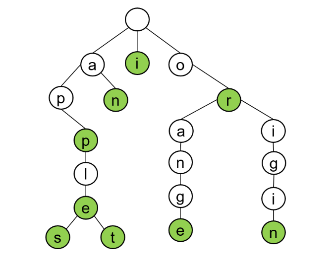

# Word Suggestion Engine

This program simulates a word suggestion search engine by allowing users to interactively add words to a trie structure and obtain word suggestions based on user input.

## Features
- Add Words: Users can add words to the trie structure by selecting the corresponding option in the menu.
- Get Suggestions: Users can enter a word to receive suggestions based on the existing words in the trie.
- Exit: Users can choose to exit the program when they are done.

## Trie Data Structure 

Provide instructions and examples on how to use your project.

